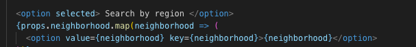
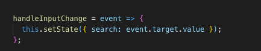

# Project 3: Chicago Architecture Finder

## General Overview

[Chicago Architecture Finder](https://chiarchfindr.herokuapp.com/)
is a fullstack React application designed to assist architecture aficionados, tourists, art history students, or anyone interested in learning about the rich history of architecture in Chicago. Architecture finder also aims to promote community involvement in historic preservation by providing a platform for individuals to tell the stories of these structures in their own words,widening the scope of user experience outside of largely constrained and canonical must-see architecture lists.

## Helper Functions and Lifecycle Methods 

This application uses lifecycle methods to render data onto the DOM and update that data. Constructor methods are called before the components are mounted to the DOM and render methods return JSX. After render is called ComponentDidMount is invoked. This ensures that the network request to the API containing building data is made as soon as the component that utilizes that data is mounted to the DOM. Utility functions are are used throughout the application to perform operations such as mapping, session storage and other pure javascript actions.

## Search Functionality

The search functionality required the creation of two different API endpoints. The first produces a list of all of the Chicago regions that a user can select. The second gets all of the entries from a selected region. The dropdown list is produced by the mongoose ‘distinct’ query method and that result is passed to a react controlled component via props into the value attribute set on our form element.

This react component renders the form, but also controls what happens in that form on subsequent user input. With a controlled component, every state mutation will have an associated handler function. 

In this case the handleInputChange method grabs onto the value of the selected neighborhood and in a
subsequent handleFormSubmit method, queries the database for all of the entries in a specific region and renders the result. 

## User Validation

This application uses Passport middleware to validate users. Local authentication strategy authenticates users using a username and password. This presented many challenges to the project that are detailed in the “Setbacks, Challenges, and Lessons Learned” section of the document.

## UI and Design 

This application utilzed the Bootstrap css framework to lay out the UI. The jumbotron image with the iconic view of Chicago's "L" train is meant to signal that this application has a distintictive regional focus. Button colors were chosen to complement the aqua tones in the jumbotron image. The scripted display font is meant to be reminiscent of the ornamentation on the many works by modernist architect Louis Sullivan that can be found in Chicago. 

## Setbacks, Challenges, and Lessons Learned 

Significant setbacks were encountered with the implementation of Passport, the user validation middleware. The initial authentication validation was constructed outside of the workflow for the back end of the application, resulting in the code for that functionality needing to be rebuilt into the back end that had been created by another team member. Another challenge related to this was the need for the buildings API and the user API to be associated. Because this wasn’t integrated into the planning of backend construction this resulted in a significant amount of time being devoted to rethinking and constructing data models, methods, and routes to both save buildings to a specific user and ensure that certain app functionalities were restricted to logged in users. 

A separate challenge we encountered was the reduplication of front-end work after work had been committed to the master branch on Github. 

A low-level challenge we faced was our need for a dataset specific to the Chicago region. As a result, seed data had to be created by hand. This could have been a more fraught process, but close collaborations between team members and discussions about the specific needs of the data were accomplished early on there were no roadblocks. 

In future work it will be important to carefully plan data needs before laying down any code. This would have also eliminated challenges we faced during UI implementation as the team could have completed work on features or components that then could have been styled without disruptions.

## Directions for Future Development

The team is excited to continue work on this application in a post-bootcamp world. We plan to incorportate the Google Maps API so that users can see precise locations. Search functionalities will be expanded to include all of Chicago's 77 neighborhoods, and a 'search by prominent architect' feature will also be implemented. This application also lends itself well to a mobile platform with an image upload feature, so we hope to work in that direction as well. 

## Technologies Used 

* [Bootstrap](https://getbootstrap.com/)
* [Express](https://www.npmjs.com/package/express)
* [Mongoose](mhttps://mongoosejs.com)
* [Morgan](https://www.npmjs.com/package/morgan)
* [npm star rating](https://www.npmjs.com/package/react-star-ratings)
* [passport](http://www.passportjs.org/)
* [React](https://reactjs.org/)

